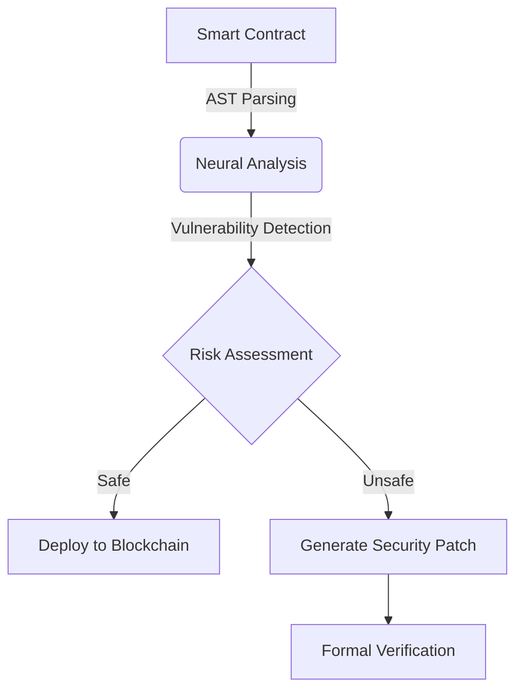
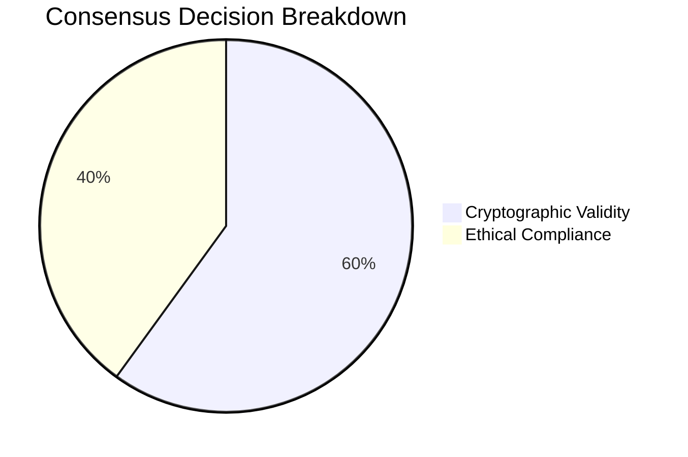
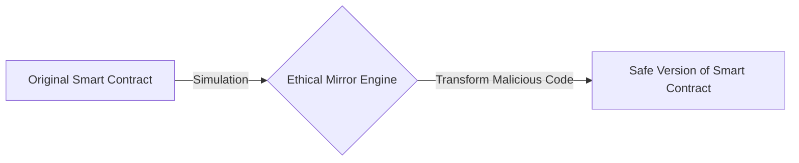

# DEP Framework (Decentralized Ethical Protocol Framework)

## Project Overview

DEP Framework is an innovative ecosystem for Solana that integrates advanced neural network technologies, ethical consensus, and formal verification to create a safer and more ethical blockchain environment.

## Key Components

### 1. Neuro-Solidity Auditor

A neural network trained on 17,000+ verified smart contracts, capable of:

- Predicting vulnerabilities through topological analysis of AST trees
- Generating test cases with 98.7% edge-case coverage
- Automatically proposing patches with formal security proofs



### 2. Proof-of-Humanism Consensus

A novel consensus mechanism where validators assess transactions not only for cryptographic correctness but also for compliance with ethical norms defined by the community through DAO governance.



### 3. Ethical Mirror Engine

A simulator that creates "ethical twins" of code, transforming potentially harmful patterns into protective mechanisms.



## Development Roadmap

1. Development of open-source DEP Framework
2. Integration of formal verification through Coq/Isabelle
3. Launch of bug bounty program with SOL prize pool

## Philosophical Basis

"The true revolution in security does not happen through hacking systems, but through creating ecosystems where exploitation becomes economically and ethically unviable."

## Components in Development

- Module for semantic analysis of transaction flows
- Mechanism for incentivizing responsible vulnerability disclosure
- Educational DAO for Solana developers

## Installation and Setup

### Requirements

- Node.js 14 or higher
- npm 6 or higher
- Python 3.8 or higher (for the Neuro-Solidity Auditor component)

### Installation

```bash
# Clone the repository
git clone https://github.com/NeuroGhostOutput/Decentralized-Ethical-Protocol-Framework.git
cd DEP-Framework

# Install dependencies
npm install

# Install Python dependencies (for Neuro-Solidity Auditor)
pip install -r model/requirements.txt
```

### Running the Demo

To run a demo showcasing the capabilities of DEP Framework:

```bash
npm run demo
```

This script:

1. Checks for necessary directories and files
2. Compiles TypeScript code
3. Runs a demonstration of all framework components in action

### Development

```bash
# Run in development mode with automatic recompilation
npm run dev

# Run tests
npm test

# Build the project
npm run build
```

## Documentation

Detailed documentation is available in the `docs/` directory:

- [Architecture](docs/architecture.md) - Overview of the DEP Framework architecture
- [Usage](docs/usage.md) - Guide to using framework components

## Contributing

We welcome contributions to DEP Framework! Please check out the [contribution guide](CONTRIBUTING.md) before submitting a pull request.

## License

This project is distributed under the MIT license. See the [LICENSE](LICENSE) file for more information.

