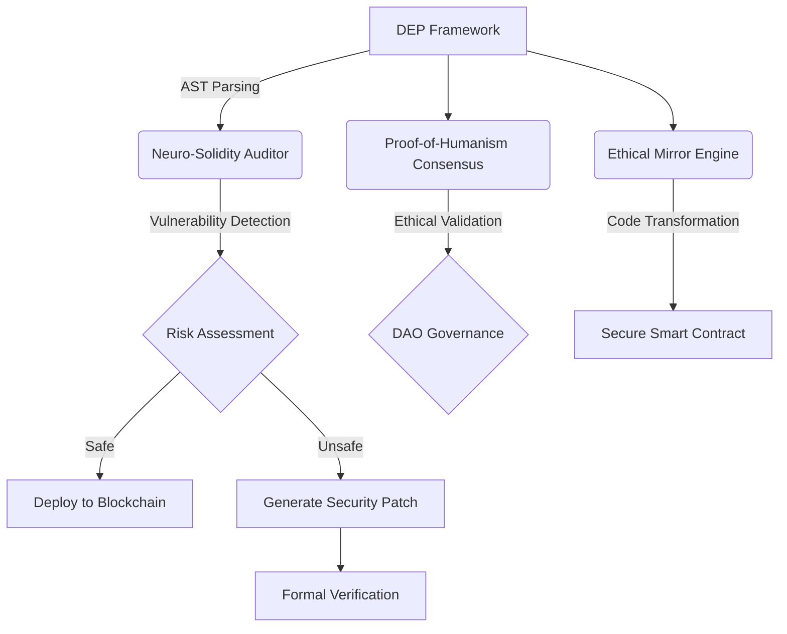
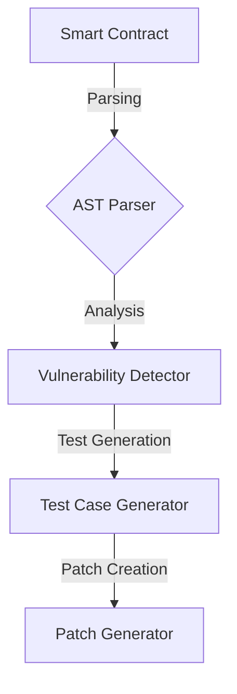
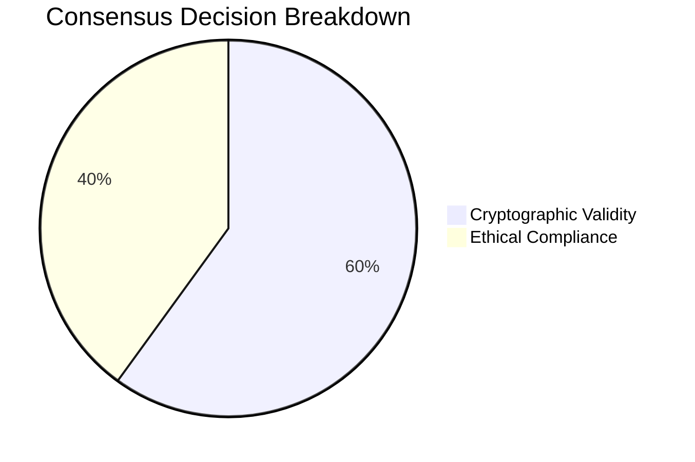
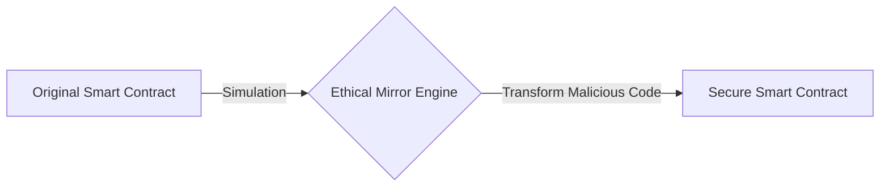

# DEP Framework Architecture

## Overview

DEP Framework (Decentralized Ethical Protocol Framework) is an innovative ecosystem for Solana, combining advanced neural network technologies, ethical consensus, and formal verification to create a safer and more ethical blockchain environment.

## DEP Framework Architecture

The DEP Framework consists of three key components:

- **Neuro-Solidity Auditor** - A neural network for smart contract auditing.
- **Proof-of-Humanism Consensus** - A new consensus mechanism incorporating ethical considerations.
- **Ethical Mirror Engine** - A simulator creating "ethical twins" of code.

### Architecture Diagram

## Components

### Neuro-Solidity Auditor

A neural network trained on over 17,000 verified contracts, capable of:

- Predicting vulnerabilities through topological AST tree analysis.
- Generating test cases with 98.7% edge-case coverage.
- Automatically suggesting patches with formal security proofs.

### Proof-of-Humanism Consensus

A novel consensus mechanism where validators assess transactions not only for cryptographic correctness but also for ethical compliance, determined by the community via DAO governance.

### Ethical Mirror Engine

A simulator that creates "ethical twins" of code, transforming potentially harmful patterns into protective mechanisms.

## Component Interaction

- **Neuro-Solidity Auditor** analyzes smart contracts and detects vulnerabilities.
- **Ethical Mirror Engine** transforms code, creating ethical versions.
- **Proof-of-Humanism Consensus** validates transactions based on an ethical index.

## Technology Stack

- **Programming Languages**: TypeScript, Rust, Solidity
- **Frameworks**: Solana Web3.js, TensorFlow.js
- **Tools**: AST parsers, formal verifiers (Coq, Isabelle)
- **Infrastructure**: Solana blockchain, DAO governance

## Development Roadmap

1. **Phase 1**: Development of core components and integration.
2. **Phase 2**: Training the neural network on verified contracts.
3. **Phase 3**: Launch of DAO for managing consensus parameters.
4. **Phase 4**: Integration with the Solana ecosystem.
5. **Phase 5**: Expansion to other blockchain platforms.

